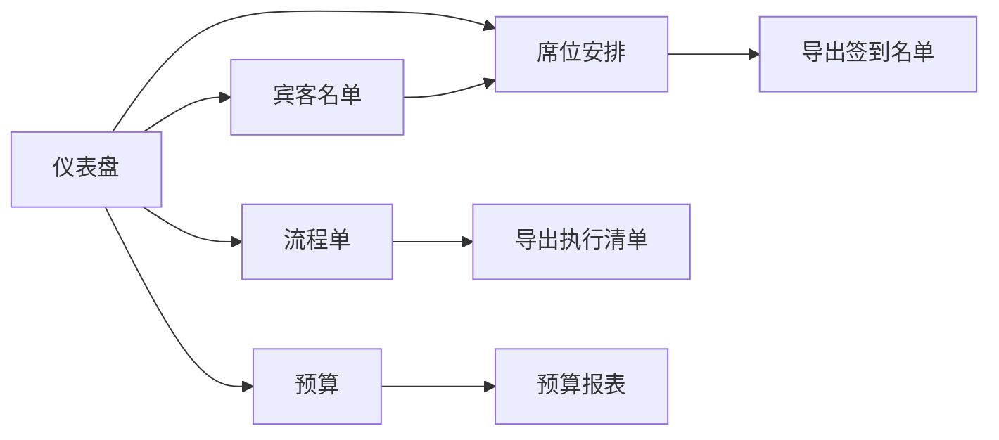

## 1. 产品概述

婚礼筹备助手是一款面向准备婚礼的新人的纯前端网页应用，帮助新人系统化地管理宾客名单、安排席位、编排婚礼流程、控制预算，让复杂的婚礼筹备变得清晰有序。

- **核心价值**：一站式婚礼筹备管理工具，通过表格、拖拽和筛选等直观交互方式，降低筹备复杂度
- **目标用户**：正在筹备婚礼的新人及其婚礼策划团队

## 2. 核心功能

### 2.1 用户角色
| 角色 | 注册方式 | 核心权限 |
|------|----------|----------|
| 新人用户 | 无需注册，本地存储 | 全部功能使用，数据本地持久化 |

### 2.2 功能模块
1. **仪表盘**：筹备进度总览、核心数据统计、快捷入口
2. **宾客名单**：宾客信息录入、家庭成员关联、出席状态、饮食忌口、按关系分组、批量导入、签到名单生成
3. **席位安排**：桌位管理、拖拽安排宾客、同桌规则、避桌规则、可视化座位图
4. **流程单**：婚礼时间线编排、环节负责人分配、仪式到敬酒全流程
5. **预算**：预算项目管理、合同付款节点、超支统计、灵感图片上传

### 2.3 页面详情

| 页面名称 | 模块名称 | 功能描述 |
|----------|----------|----------|
| 仪表盘 | 数据概览 | 宾客总数、确认出席数、桌数、预算总额与使用情况统计卡片 |
| 仪表盘 | 进度条 | 各模块筹备完成度可视化 |
| 仪表盘 | 快捷入口 | 快速跳转到各功能模块的入口卡片 |
| 仪表盘 | 近期事项 | 近期需要完成的待办事项列表 |
| 宾客名单 | 宾客表格 | 支持增删改查的宾客信息表格，包含姓名、关系、联系方式、出席状态、忌口、随行人员 |
| 宾客名单 | 分组筛选 | 按关系（男方亲友/女方亲友/同事/朋友等）分组筛选 |
| 宾客名单 | 批量导入 | 通过文本粘贴批量导入宾客通讯信息 |
| 宾客名单 | 家庭成员 | 关联家庭成员，支持一户多人的管理方式 |
| 宾客名单 | 签到名单 | 生成可打印的签到用名单，按桌号或拼音排序 |
| 席位安排 | 桌位管理 | 添加/删除餐桌，设置桌号和桌名，调整每桌人数 |
| 席位安排 | 拖拽排座 | 从宾客列表拖拽宾客到指定餐桌 |
| 席位安排 | 同桌规则 | 设置必须同桌的宾客组合 |
| 席位安排 | 避桌规则 | 设置不能同桌的宾客组合 |
| 席位安排 | 座位可视化 | 圆形餐桌可视化布局，显示宾客姓名 |
| 流程单 | 时间线 | 从仪式前到敬酒结束的完整时间线，可拖拽调整顺序 |
| 流程单 | 环节管理 | 添加/编辑/删除婚礼环节，设置时间、地点、内容 |
| 流程单 | 负责人 | 为每个环节指定负责人和联系方式 |
| 流程单 | 执行清单 | 生成婚礼当天的执行清单，可导出 |
| 预算 | 预算总览 | 总预算、已支出、剩余预算、超支项目统计 |
| 预算 | 预算项目 | 分类预算项管理（场地、餐饮、摄影、婚纱等） |
| 预算 | 合同付款 | 记录合同信息和分期付款节点及状态 |
| 预算 | 超支预警 | 标记超支项目，显示超支金额 |
| 预算 | 灵感图片 | 上传和管理婚礼风格灵感参考图片 |

## 3. 核心流程

用户打开应用后，首先看到仪表盘的总览信息。可以通过侧边导航切换到各个功能页面：
- 在宾客名单页面录入宾客信息，设置出席状态和饮食偏好
- 在席位安排页面通过拖拽方式将宾客分配到各个餐桌
- 在流程单页面编排婚礼当天的时间线和负责人
- 在预算页面记录各项开支和合同付款节点

## 4. 用户界面设计

### 4.1 设计风格

- **主色调**：香槟金（#D4AF37）与玫瑰粉（#E8B4B8）搭配，营造浪漫婚礼氛围
- **辅助色**：米白色背景（#FAF8F5），深棕文字（#3D3027）
- **按钮风格**：圆角矩形，轻微阴影，悬停有微动效
- **字体**：标题使用优雅衬线字体（Noto Serif SC），正文使用现代无衬线字体（Noto Sans SC）
- **布局风格**：左侧固定导航栏 + 右侧内容区，卡片式布局
- **装饰元素**：精致的细线分隔、柔和的渐变、微妙的纹理

### 4.2 页面设计概览

| 页面名称 | 模块名称 | UI 元素 |
|----------|----------|---------|
| 仪表盘 | 数据概览 | 四张统计卡片，图标+数字+副标题，渐变色背景 |
| 仪表盘 | 进度追踪 | 环形进度图 + 进度条列表 |
| 宾客名单 | 表格区 | 斑马纹表格，行悬停高亮，操作列图标按钮 |
| 宾客名单 | 筛选栏 | 标签式筛选器 + 搜索框 + 新增按钮 |
| 席位安排 | 左侧宾客池 | 可拖拽的宾客列表，按未分配/已分配分组 |
| 席位安排 | 右侧座位图 | 圆形餐桌网格布局，餐桌内显示宾客姓名标签 |
| 流程单 | 时间线 | 垂直时间线，时间点 + 环节卡片，可拖拽排序 |
| 预算 | 概览区 | 预算总额进度环，分类预算条形图 |
| 预算 | 明细表 | 可展开的预算分类表格，显示子项和付款节点 |

### 4.3 响应式

- 桌面端优先设计，适配 1280px 以上宽度
- 平板端侧边栏收起为图标导航
- 移动端底部标签栏导航，表格改为卡片式列表

### 4.4 交互动效

- 页面切换淡入淡出过渡
- 拖拽元素半透明跟随效果
- 表格行和按钮的悬停微动效
- 数据变化时数字滚动动画
- 模态框平滑弹出效果
