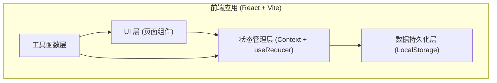
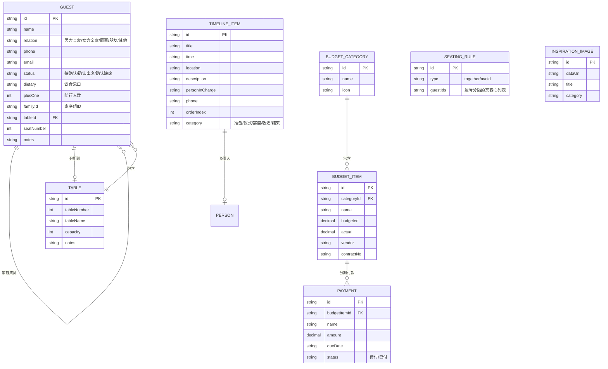

## 1. 架构设计



## 2. 技术描述

- **前端框架**：React@18 + TypeScript
- **构建工具**：Vite@5
- **样式方案**：TailwindCSS@3
- **状态管理**：React Context + useReducer
- **数据持久化**：LocalStorage
- **拖拽交互**：原生 HTML5 Drag & Drop API
- **图标**：Lucide React
- **日期处理**：date-fns

## 3. 路由定义

| 路由 | 页面 | 功能 |
|------|------|------|
| / | 仪表盘 | 数据概览、进度追踪、快捷入口 |
| /guests | 宾客名单 | 宾客管理、分组筛选、批量导入、签到名单 |
| /seating | 席位安排 | 桌位管理、拖拽排座、同桌/避桌规则 |
| /timeline | 流程单 | 时间线编排、环节管理、负责人分配 |
| /budget | 预算 | 预算管理、合同付款、超支统计、灵感图片 |

## 4. 数据模型

### 4.1 数据模型定义



### 4.2 数据初始化

应用启动时从 LocalStorage 加载数据，如果没有数据则使用预设的示例数据，确保用户首次打开即可看到完整的演示效果。

## 5. 项目结构

```
src/
├── components/          # 通用组件
│   ├── Layout/         # 布局组件
│   ├── Modal/          # 模态框
│   ├── Button/         # 按钮
│   ├── Table/          # 表格组件
│   └── Card/           # 卡片组件
├── pages/              # 页面组件
│   ├── Dashboard/      # 仪表盘
│   ├── Guests/         # 宾客名单
│   ├── Seating/        # 席位安排
│   ├── Timeline/       # 流程单
│   └── Budget/         # 预算
├── context/            # 状态管理
│   ├── AppContext.tsx
│   └── reducers.ts
├── types/              # TypeScript 类型定义
│   └── index.ts
├── utils/              # 工具函数
│   ├── storage.ts
│   ├── export.ts
│   └── helpers.ts
├── data/               # 示例数据
│   └── mockData.ts
├── App.tsx
├── main.tsx
└── index.css
```

## 6. 核心技术决策

1. **纯前端架构**：所有数据存储在浏览器 LocalStorage 中，无需后端服务，打开即用
2. **Context 全局状态**：使用 React Context 管理全局应用状态，各页面共享数据
3. **原生拖拽 API**：使用 HTML5 Drag & Drop 实现席位安排拖拽，避免引入额外依赖
4. **TailwindCSS 样式**：原子化 CSS，快速构建美观 UI，配合 CSS 变量实现主题
5. **Lucide 图标**：轻量级图标库，与婚礼主题风格协调
6. **TypeScript 类型安全**：完整的类型定义，提升开发效率和代码可维护性
